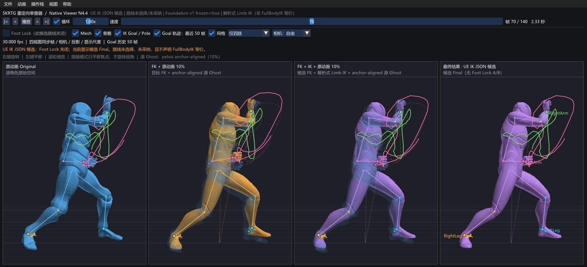

<a id="top" name="top"></a>

<h1 align="center">SKRTG Engine</h1>

<p align="center">
  离线、可验证的骨骼重定向工具链。<br>
  An offline, verifiable skeletal-retargeting toolchain.
</p>

<p align="center">
  <a href="#read-chinese"></a>
  <a href="#read-english"></a>
  <a href="#current-build"></a>
  <a href="#license"></a>
</p>

<p align="center">
  <code>Windows x64</code> · <code>C++20</code> · <code>Character Definition v1</code> · <code>SKRV v1</code>
</p>

<p align="center">
  
</p>

<p align="center"><sub>实机画面 / Actual application capture — Mixamo Fist Fight A → UE5 Manny，帧 70 / 140；Original、FK、Foundation 与 Final 四视图同步。</sub></p>

---

<a id="read-chinese" name="read-chinese"></a>

## 中文

一句话介绍 SKRTG：它把不同 DCC 和动画管线中的角色配置统一成可验证的 Character Definition，再离线完成 FBX 动画重定向、结果验证和四视图审阅。配置不绑定 Unreal Engine；它可以来自导出的 UE IK Rig，也可以来自 MotionBuilder、3ds Max 或其他 DCC 中定义的骨骼链。

SKRTG 关心的不是配置由哪个软件生成，而是信息是否明确：完整骨骼层级与唯一骨名、参考姿势及坐标系/单位、Retarget Root 与 Pelvis、每条链的起止骨骼、可选 IK Goal / Pole / 求解模式，以及源目标之间的显式姿势对齐与稳定身份指纹。只要导出器或适配器能提供这些语义，就可以进入同一个 `.skrtgprofile` 工作流。

我们希望它做事有依据，也愿意把没做完的地方写清楚。配置不完整时，SKRTG 会停下来报错；它不会猜骨骼名，也不会为了“看起来能跑”而悄悄换一条路线。

<a id="current-build" name="current-build"></a>

### 目前做到哪一步

| 项目 | 当前状态 |
| --- | --- |
| 角色 Profile | **通过**：Mixamo Y Bot、MetaHuman、UE5 Manny、SMPL |
| 非同源有向路线 | **12 / 12** 通过静态预检 |
| 动态任务 | **18 / 18** 完成并通过结果校验 |
| 正式源动画 | **4 段**：2 段 Mixamo、2 段 Manny |
| MetaHuman / SMPL 作为源 | **黄灯**：已走通 round-trip probe，仍缺独立创作的源动画语料 |
| 路线采纳状态 | `candidateRouteSelected=false` / `candidateRouteAdopted=false` |
| Vicon | 本阶段暂不处理 |

这里的 18 个动态任务不是同一种证据：其中 12 个使用用户提供的 Mixamo / Manny 原始动画；另外 6 个是明确标记的 UE 5.8 round-trip probe，用来验证 MetaHuman / SMPL 的反向运行链。Probe 能证明链路可运行，但不能替代真正的 MetaHuman / SMPL 源动画质量验收。

完整记录见 [Non-Vicon Matrix V1](docs/NON_VICON_MATRIX_V1.md)。

### 现在可以做什么

- 用统一的 `skrtg` CLI 完成能力发现、环境检查、Profile 导入/检查、Batch、Bridge、SKRV 验证和 Agent 调试；`--json` 提供稳定机器协议。
- 通过格式适配器把 UE IK Rig 导出、SKRTG Character Definition JSON/XML，以及来自 MotionBuilder、3ds Max 等 DCC 的骨骼链导出规范化为同一个角色定义；也可以只读探测 Rest FBX，并明确列出尚缺的信息。
- 用 `.skrtgprofile v1` 把一个角色的 Rest FBX、规范化/编译后的 Rig 定义、显式对齐数据、来源记录和完整性清单放进同一个可验证角色包。
- 在 Viewer 中安装、检查、切换和移除角色 Profile；同一角色可以安装多个版本，默认启用最高 SemVer 版本。
- 在批处理界面选择源角色和目标角色。动画列表只显示属于当前源骨骼、且 skeleton signature 完全匹配的动画。
- 一次选择多段动画，预检全部通过后再开始；运行时固定一个 Worker，处理完一段才进入下一段。
- 为每段动画生成独立的目标 FBX 和 SKRV v1 审阅包。
- 在原生 Viewer 的 Original、FK、Foundation、Final 四个同步视图中检查结果，并在同一批结果里切换动画。
- 对输入 Profile、Catalog、FBX、Golden JSON 和输出文件做 SHA-256 绑定与复核。

### 数据怎么进入 SKRTG

```text
UE IK Rig export / MoBu or 3ds Max chain export / Character Definition JSON or XML / Rest FBX probe
  → format adapter
  → skrtg.character_definition.v1
  → skrtg profile probe / normalize / create
  → .skrtgprofile

.skrtgprofile + 外部动画 Catalog
  → Bridge v5 / Batch v3
  → Retarget Worker（当前内置 UE-compatible JSON backend）
  → 目标 FBX + SKRV v1
  → Native Viewer
```

运行时不要求安装或启动 UE，也不会直接读取 `.uasset`、MotionBuilder 场景或 3ds Max 场景。来自 UE 的配置可以导出为 IK Rig JSON；其他 DCC 可以直接导出 `skrtg.character_definition.v1` JSON/XML，或通过专用适配器转换。当前内置直接适配器覆盖 UE IK Rig JSON、SKRTG JSON/XML 与 Rest FBX 探测；新增 DCC 原生格式时沿用同一适配器边界。

### 从源码构建

需要：

- CMake 3.23+
- 支持 C++20 的编译器（已验证 Visual Studio 2022）
- Autodesk FBX SDK 2020.3.9
- 支持 OpenGL 3.3 的显卡驱动

```powershell
cmake -S . -B build -A x64 `
  -DSKRTG_FBX_SDK_ROOT="C:/Program Files/Autodesk/FBX/FBX SDK/2020.3.9"
cmake --build build --config Release --parallel
ctest --test-dir build -C Release --output-on-failure
```

Autodesk FBX SDK 及其许可证不会由本仓库重新分发。

私有角色和动画目录通过 `SKRTG_RETARGET_ASSET_CATALOG_DIR` 传入，不需要复制进仓库：

```powershell
cmake -S . -B build -A x64 `
  -DSKRTG_FBX_SDK_ROOT="C:/Program Files/Autodesk/FBX/FBX SDK/2020.3.9" `
  -DSKRTG_RETARGET_ASSET_CATALOG_DIR="D:/private/skrtg_catalog"
```

### 现在还不能承诺什么

- 当前只正式验证 Windows x64。
- Vicon 尚未进入这一阶段。
- MetaHuman 手指仍保留现有 Coordinate Basis Fix V1 基线；已知的手指塌陷问题还没有被新算法解决。
- MetaHuman / SMPL 作为源角色时，目前只有 round-trip probe，没有独立源动画语料。
- 不自动臆测骨骼链、Root/Pelvis 或源目标映射，也不在缺少必要语义时静默回退。
- 材质、贴图、Morph Target、Blend Shape fidelity、跨平台与便携运行时尚未进入发布门槛。
- Viewer 只读取 SKRV，不会在显示层重新计算或“美化”算法差异。

这个公开仓库只放源码、测试和文档。角色 FBX、动画、UE 工程、导出的 Rig / Golden JSON、`.skrtgprofile`、SKRV 和编译包都留在私有数据边界之外。

### 继续阅读

- [统一 CLI 与 Agent 协议](docs/CLI.md)
- [Character Profile authoring v2](docs/CHARACTER_PROFILE_AUTHORING_V2.md)
- [工程目录与依赖方向](docs/PROJECT_LAYOUT.md)
- [参与开发](CONTRIBUTING.md)
- [Agent 工作合同](AGENTS.md)
- [架构与运行链](docs/ARCHITECTURE.md)
- [`.skrtgprofile v1` 合同](docs/SKRTGPROFILE_V1.md)
- [Profile Batch v3 合同](docs/PROFILE_BATCH_V3.md)
- [性能与计时证据](docs/PERFORMANCE.md)
- [资产边界](docs/ASSET_POLICY.md)
- [四角色矩阵验证记录](docs/NON_VICON_MATRIX_V1.md)

<p align="right"><a href="#top">返回顶部 ↑</a></p>

---

<a id="read-english" name="read-english"></a>

## English

SKRTG normalizes character configurations from different DCC tools and animation pipelines into one verifiable Character Definition, then performs FBX retargeting, validation, and four-view review offline. The configuration is not tied to Unreal Engine: it may come from an exported UE IK Rig, or from skeleton chains defined in MotionBuilder, 3ds Max, or another DCC.

SKRTG cares about explicit semantics rather than the authoring application: a complete skeleton hierarchy with unique bone names, a reference pose with coordinate system and units, Retarget Root and Pelvis roles, start/end bones for every chain, optional IK goals, poles and solve modes, explicit source/target pose alignment, and a stable identity fingerprint. Any exporter or adapter that supplies those facts can enter the same `.skrtgprofile` workflow.

The project is deliberately strict about evidence. When configuration is incomplete, it stops with an error. It does not guess bone names or quietly switch to a different route just to produce something that looks plausible.

### Where the project stands

| Area | Current status |
| --- | --- |
| Character profiles | **Passed**: Mixamo Y Bot, MetaHuman, UE5 Manny, and SMPL |
| Directed non-identity routes | **12 / 12** passed static preflight |
| Dynamic jobs | **18 / 18** completed and verified |
| Production source clips | **4 clips**: two Mixamo and two Manny motions |
| MetaHuman / SMPL as sources | **Caution**: round-trip probes pass, but independently authored source clips are still missing |
| Route adoption | `candidateRouteSelected=false` / `candidateRouteAdopted=false` |
| Vicon | Deferred from this stage |

The 18 dynamic jobs do not all carry the same weight. Twelve use the original Mixamo and Manny clips supplied for the project. The remaining six are clearly labeled UE 5.8 round-trip probes for the MetaHuman and SMPL reverse paths. Those probes show that the runtime path works; they are not a substitute for quality validation with independently authored MetaHuman or SMPL motion.

See [Non-Vicon Matrix V1](docs/NON_VICON_MATRIX_V1.md) for the validation record.

### What works today

- The unified `skrtg` CLI covers capability discovery, environment checks, Profile import/inspection, Batch, Bridge, SKRV verification, and agent diagnostics. `--json` provides a stable machine contract.
- Format adapters normalize UE IK Rig exports, SKRTG Character Definition JSON/XML, and skeleton-chain exports from tools such as MotionBuilder or 3ds Max into one character model. A Rest FBX can also be probed read-only, with missing semantics reported explicitly.
- `.skrtgprofile v1` packages a character's rest FBX, normalized/compiled rig definition, explicit alignment data, provenance, metadata, and integrity inventory into one verifiable unit.
- The Viewer can inspect, install, switch, and remove profiles. Multiple versions can coexist, with the highest SemVer version active by default.
- The batch UI selects source and target profiles, then shows only animations owned by the selected source skeleton with an exact matching skeleton signature.
- Multiple clips can be selected at once. The complete set is preflighted first, then processed serially with one Worker.
- Every clip produces its own target FBX and SKRV v1 review package.
- The native Viewer keeps Original, FK, Foundation, and Final lanes synchronized and can switch between verified results from the same batch session.
- Profiles, catalogs, FBX files, Golden JSON, and outputs are bound and rechecked with SHA-256.

### How data moves through SKRTG

```text
UE IK Rig export / MoBu or 3ds Max chain export / Character Definition JSON or XML / Rest FBX probe
  → format adapter
  → skrtg.character_definition.v1
  → skrtg profile probe / normalize / create
  → .skrtgprofile

.skrtgprofile + external animation catalog
  → Bridge v5 / Batch v3
  → Retarget Worker (current built-in UE-compatible JSON backend)
  → target FBX + SKRV v1
  → Native Viewer
```

The runtime does not require UE to be installed or running, and it does not directly parse `.uasset`, MotionBuilder scene, or 3ds Max scene files. UE configurations can be exported as IK Rig JSON; other DCC tools can emit `skrtg.character_definition.v1` JSON/XML directly or use a dedicated adapter. Built-in direct adapters currently cover UE IK Rig JSON, SKRTG JSON/XML, and Rest FBX probing. New native DCC formats use the same adapter boundary.

### Build from source

Requirements:

- CMake 3.23 or newer
- A C++20-capable compiler (Visual Studio 2022 is tested)
- Autodesk FBX SDK 2020.3.9
- An OpenGL 3.3-capable graphics driver

```powershell
cmake -S . -B build -A x64 `
  -DSKRTG_FBX_SDK_ROOT="C:/Program Files/Autodesk/FBX/FBX SDK/2020.3.9"
cmake --build build --config Release --parallel
ctest --test-dir build -C Release --output-on-failure
```

The Autodesk FBX SDK and its license are not redistributed by this repository.

Private character and animation data can stay outside the repository:

```powershell
cmake -S . -B build -A x64 `
  -DSKRTG_FBX_SDK_ROOT="C:/Program Files/Autodesk/FBX/FBX SDK/2020.3.9" `
  -DSKRTG_RETARGET_ASSET_CATALOG_DIR="D:/private/skrtg_catalog"
```

### Honest boundaries

- Windows x64 is the only formally validated platform today.
- Vicon is not part of this stage.
- MetaHuman fingers remain on the current Coordinate Basis Fix V1 baseline; the known finger-collapse issue has not been solved by a newly adopted algorithm.
- MetaHuman and SMPL have round-trip source probes, not independently authored source-motion coverage.
- There is no guessed chain, Root/Pelvis, or source/target mapping, and no silent fallback when required semantics are missing.
- Materials, textures, morph targets, Blend Shape fidelity, cross-platform builds, and a portable runtime are not release gates yet.
- The Viewer reads SKRV results; it does not recompute or exaggerate algorithmic differences in the presentation layer.

This public repository contains source code, tests, and documentation only. Character FBX files, animation clips, Unreal projects, exported Rig / Golden JSON, `.skrtgprofile` packages, SKRV results, and compiled releases stay outside the public data boundary.

### Documentation

- [Unified CLI and agent contract](docs/CLI.md)
- [Character Profile authoring v2](docs/CHARACTER_PROFILE_AUTHORING_V2.md)
- [Project layout and dependency direction](docs/PROJECT_LAYOUT.md)
- [Contributing](CONTRIBUTING.md)
- [Agent working contract](AGENTS.md)
- [Architecture and runtime flow](docs/ARCHITECTURE.md)
- [`.skrtgprofile v1` contract](docs/SKRTGPROFILE_V1.md)
- [Profile Batch v3 contract](docs/PROFILE_BATCH_V3.md)
- [Performance and timing evidence](docs/PERFORMANCE.md)
- [Asset policy](docs/ASSET_POLICY.md)
- [Four-profile matrix validation](docs/NON_VICON_MATRIX_V1.md)

<p align="right"><a href="#top">Back to top ↑</a></p>

---

<a id="license" name="license"></a>

## License / 许可证

SKRTG Engine 的自有源码以 [Apache License 2.0](LICENSE) 发布。仓库内随附的第三方组件继续适用各自的许可证，详见 [NOTICE](NOTICE) 与 [Third-Party Notices](native_viewer/THIRD_PARTY_NOTICES.md)。

Original SKRTG Engine source code is released under the [Apache License 2.0](LICENSE). Bundled third-party components remain under their respective licenses; see [NOTICE](NOTICE) and [Third-Party Notices](native_viewer/THIRD_PARTY_NOTICES.md).

<p align="right"><a href="#top">Back to top / 返回顶部 ↑</a></p>
