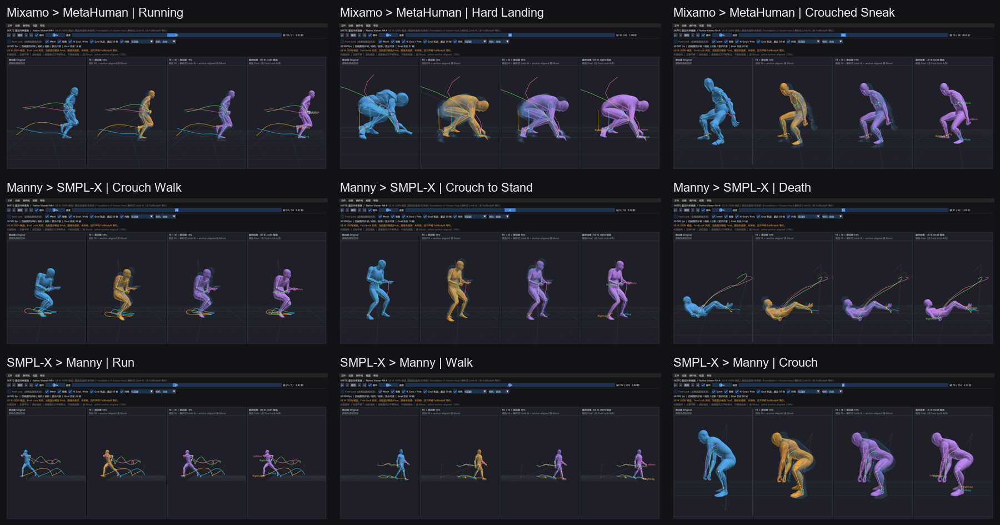

# New animation regression v1

Status: local Windows x64 evidence accepted on 2026-08-07. The source assets,
standardized animation files, Golden JSON, Profiles, SKRV packages, and final
FBX files remain outside this public repository.

## Scope

This regression adds three independently selected clips from each of three
source families. It is deliberately smaller than a full corpus run and covers
contrasting motion semantics:

- Mixamo: running, hard landing, and crouched sneaking;
- UE5 Manny: rifle crouch walk, rifle crouch-to-stand, and death;
- UE-compatible SMPL-X/ACCAD: running, walking, and crouching.

The nine jobs isolate the core FK plus analytic Limb IK path. Foot Lock,
Contact Foot Plant, Floor Constraint, Stride Warping, Weapon Goals, and the
candidate Operation System were disabled. A passing result therefore does not
select or adopt those operators.

## Results

| Route | Clips | Frames | Batch wall time | Result |
| --- | ---: | ---: | ---: | ---: |
| Mixamo -> MetaHuman | 3 | 122 | 40.071 s | 3 / 3 |
| UE5 Manny -> SMPL-X | 3 | 141 | 12.072 s | 3 / 3 |
| SMPL-X -> UE5 Manny | 3 | 435 | 28.018 s | 3 / 3 |
| Total | 9 | 698 | 80.161 s | 9 / 9 |

All nine clips reported a committed Limb IK transaction and zero fail-closed
chain records. Verified final-FBX inspection reported:

- zero local-transform mismatches;
- zero model-transform mismatches;
- maximum model translation round-trip error of
  `4.54322070673856e-05 cm`;
- maximum model rotation round-trip error of
  `3.58183437850995e-05 degrees`;
- maximum Limb IK endpoint error of `1.27897692437e-13 cm`.

These values prove the recorded solver/export contract, not subjective motion
quality by themselves.

## Visual evidence

Each tile is a Native Viewer middle-frame capture with synchronized Original,
FK, Foundation, and Final lanes. The audited frames showed no whole-character
axis inversion, rest-pose collapse, or exploded skin. This is a representative
frame gate; full-playback and close-up finger review remain separate artistic
checks.

## Findings and boundaries

1. Multi-LOD Rest FBX files need a Profile-authored exact Mesh selection. The
   first Manny attempt correctly failed closed; an explicit LOD0 selection
   then passed all three jobs. Node suffixes and polygon counts are not used
   as inference.
2. The SMPL-X inputs required separate contracts for joint-local rotations
   and root/world motion. The accepted evidence entered SKRTG as standardized,
   hash-bound FBX plus Golden data. A native NPZ importer is not included in
   this repository.
3. MetaHuman finger deformation remains on the preserved Coordinate Basis Fix
   V1 baseline. The overview capture is not a close-up finger-quality pass.
4. Some existing private Profile/catalog identifiers still use `smpl` while
   the validated source data identifies itself as SMPL-X. That naming migration
   must be explicit and versioned.
5. Private validation data is not bundled or redistributed by the source
   repository. Reproducing the corpus run requires separately authorized
   source assets and generated configuration evidence.
